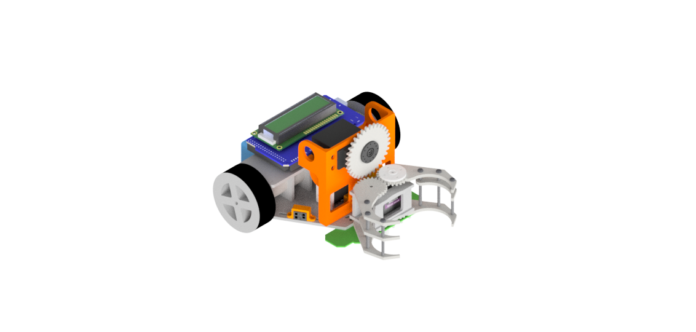
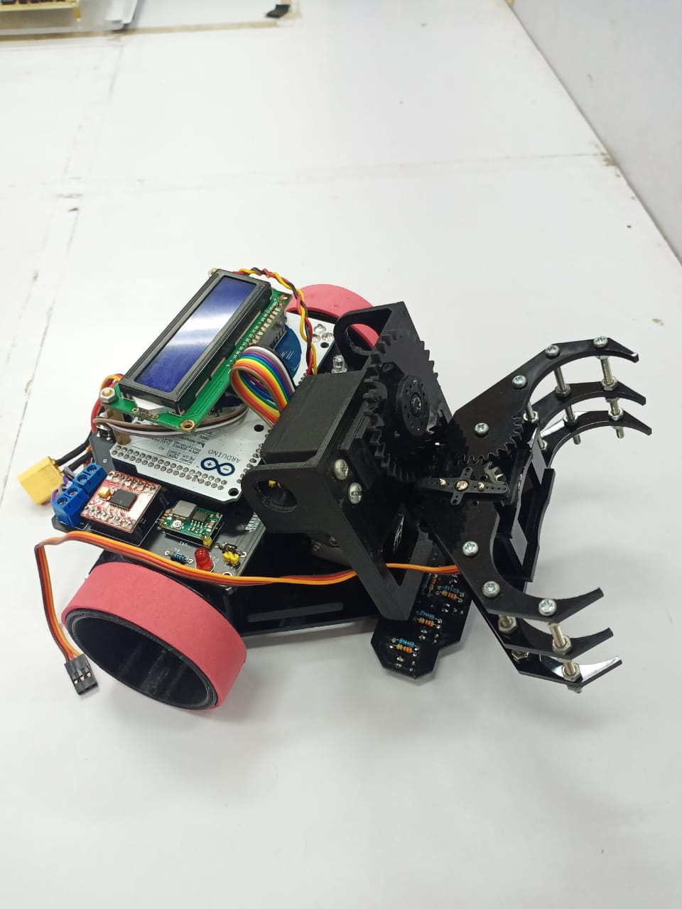
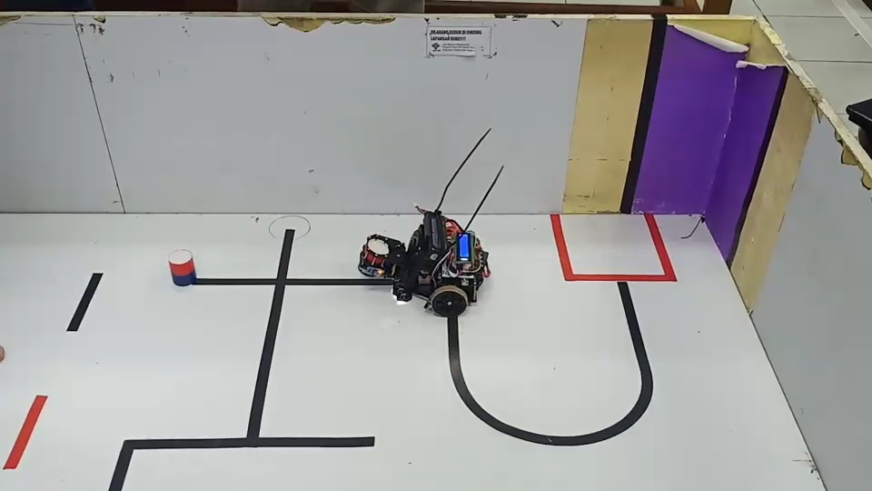
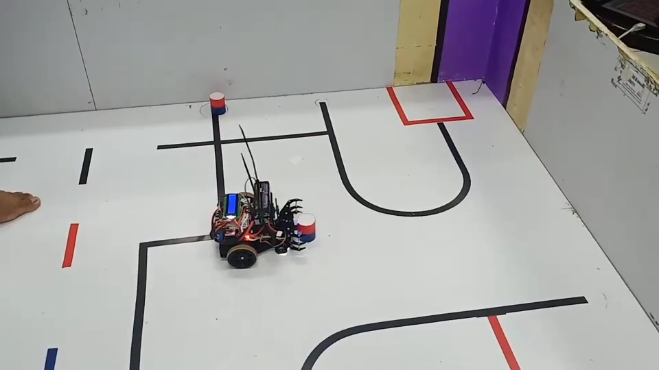

# Line_Follower_Transporter

Transporter Robot is a robot whose mission is to move objects from the port to the target according to their color by following the area directions in the form of lines and walls.

The robot uses an Aduino Mega controller equipped with a 16x2 LCD display. The robot is equipped with a 2-axis gripper, namely roll and pitch to lift and flip objects, where the gripper uses the Emax Servo, the RDS3115 Servo as the roll axis, and the Futaba S300 Servo as the axis pitch. The robot is also equipped with a line sensor in the form of an LED - Photo Diode to follow the black, red and blue lines. Then the Photo Diode color sensor to read the color reflection of the object (red or blue), the Photo Diode proximity sensor to follow the wall.

Demo : https://youtu.be/CKx7lB9OX2A

  
  
  
  

